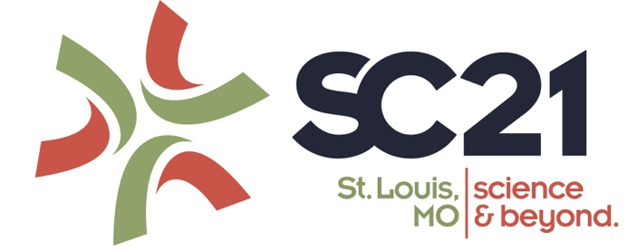

# About Me

I am a Master Student in Computer Science at [Tufts University](https://www.tufts.edu), currently focusing on computer engineering. I obtained my Bachelor's degree in Computer Science and Technology from [ShanghaiTech University](https://www.shanghaitech.edu.cn/eng/), during which I was supervised by Prof. [Quan Li](https://faculty.sist.shanghaitech.edu.cn/liquan/) in ViSeer Lab and Prof. [Shu Yin](https://scholar.google.com/citations?user=CJGqcXoAAAAJ) over SC21 HPC Competition.    
As an undergrad RA in Viseer Lab, my routine was about paper reading, designing and developing visual analytics systems, and lots of teamwork.     
As a Master student now, I'm developing my full-stack skills further and actively seeking job oppertunities as a SE.    
Apart from that, I'm always enthusiastic about trying new projects in all areas. My current interests are **SE (Software Engineering), HCI (Human-Computer Interaction)** and **IoT (Internet of Things)**. I program mostly in **C/C++, Python, H5+C3+JS**. Feel free to contact me in English and Mandarine.

## Education 

2022 - 2024 (expected)  | M.S. in CS, Tufts University
2018 - 2022  | B.E. in CS, ShanghaiTech University   

## Selected Projects

Smart Jetbot based on Nvidia Jetson Nano[↗](https://github.com/lindazha0/jetApp) | Full-Stack & Mechanism
Volume Rendering with Interactive Adjustable Transfer Function[↗](https://github.com/lindazha0/CS271_Project_VolumnRendering) | Computer Graphics
PintOS (from Stanford)[↗](https://github.com/lindazha0/CS130_PintOS_Projects) | Operating System
MOBAVis: Visual Analytics for Real-time Forecasting of MOBA Events[↗](https://github.com/mobaVis) | Visual Analytics
PPI Prediction Based on Multi-Channel Deep Learning | Deep Learning/ Bioinformatics
Card Game: Landlord-Off[↗](https://github.com/20CS181)| Artificial Intelligence

## Publications

<b>BPCoach: Exploring Hero Drafting in Professional MOBA Tournaments via Visual Analytics</b>    
Shiyi Liu, Ruofei Ma, **Chuyi Zhao**, Zhenbang Li, Quan Li    
(under revision by [_ACM CHI2023_](https://chi2023.acm.org/))

<b>Critique of "A Parallel Framework for Constraint-Based Bayesian Network Learning via Markov Blanket Discovery" by SCC Team from ShanghaiTech University [↗](https://ieeexplore.ieee.org/document/9882379)</b>    
Guancheng Li; Songhui Cao; **Chuyi Zhao**; Siyuan Zhang; Yuchen Ji; Haotian Jing; Zecheng Li ; Jiajun Cheng; Yiwei Yang; Shu Yin    
(accepted by [_IEEE Transactions on Parallel and Distributed Systems_](https://ieeexplore.ieee.org/xpl/mostRecentIssue.jsp?punumber=71))
    

<b>PromotionLens: Inspecting Promotion Strategies of OnlineE-commerce via Visual Analytics [↗](https://arxiv.org/abs/2208.01404)</b>    
Chenyang Zhang, Xiyuan Wang, **Chuyi Zhao**, Yijing Ren, Tianyu Zhang, Zhenhui Peng, Xiaomeng Fan, Xiaojuan Ma, Quan Li    
(accepted by [_IEEE VIS2022_](http://ieeevis.org))    
    

## Award

11/2022  |  2nd Place in [SC21 Students Competition](https://studentclustercompetition.us/2021/index.html)   
<!-- ## Blogs -->

<!-- Text can be **bold**, _italic_, or ~~strikethrough~~.
  -->
