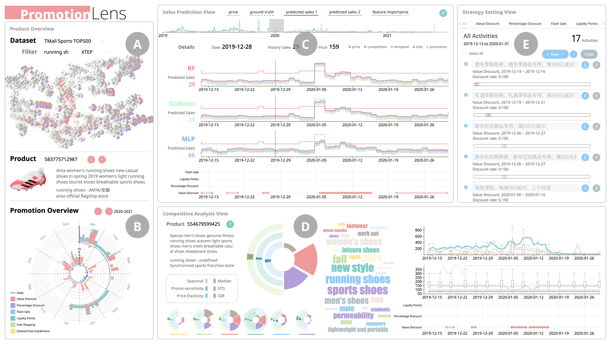

# About Me

I am a senior student in at [ShanghaiTech University](https://www.shanghaitech.edu.cn/eng/), supervised by [Prof. Quan Li](https://faculty.sist.shanghaitech.edu.cn/liquan/). In his Viseer Lab, my daily routine is about paper reading, visual analytics system designing and development. I'm always enthusiastic about trying new projects in all areas.     
My current interests are in **AI, VIS** and **IoT**. I program mostly in **C/C++, Python, H5+C3+JS**. Feel free to contact me in English and Mandarine.

## Education 

2018 - 2022  | B.E. in CS, ShanghaiTech University   

## Honor

11/2022  |  2nd Place in [SC21 Students Competition](https://sc21.supercomputing.org/program/studentssc/student-cluster-competition/)   

## Selected Projects

Smart Jetbot based on Jetson Nano | Full-stack 
Volume Rendering with Interactive Adjustable Transfer Function | Computer Graphics
PintOS | Operating System

## Research Experience

PromotionLens: Inspecting Promotion Strategies of OnlineE-commerce via Visual Analytics (Under Review for _IEEE VIS2022_)
   
<!-- ## Blogs -->

<!-- Text can be **bold**, _italic_, or ~~strikethrough~~.
  -->
